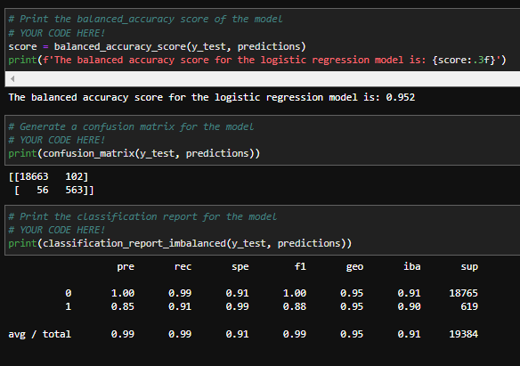
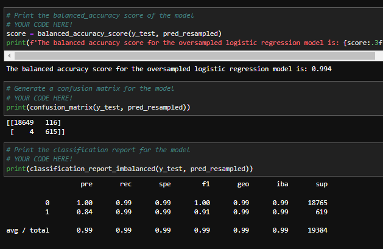

# Credit Risk Predictor
Challenge 12 for Fintech bootcamp through UC Berkeley. Using logistic regression models to help predict credit loan risk. Utilizing sklearn packages and oversampling techniques to create two logistic regression models to predict credit loan risk and compare the results.

The notebook in this repo `credit_risk_resampling.ipynb` reads in a CSV file containing loan data with several features that ultimately result in a loan being low-risk '0' or high-risk '1'. The features that determine the risk level can be seen below;

In the above image we can see there are 7 features (from loan_size to total_debt) that help decide whether the loan_status is a 0 or a 1 (low-risk or high-risk). The purpose of creating logistic regression models for this data is to see if we can get the model to accurately predict whether new loans, containing only the feature data, will be low or high risk(0 or 1). Given that I am trying to create a model that will predict high-risk loans or a '1', I wanted to see how many 1s there was in my testing data compared to 0s. 
By using `value_counts()`

I noticed that roughly 3% of the data is high-risk, meaning any model trained on the original data would be really good at detecting low-risk loans or 0s. However, it would struggle to accurately detect any high-risk loans due to the small amount of them in the test data. To account for this I created two models. One on the original data, and one on oversampled data using the RandomOversampler from the imblearn package. Then after having two models I could compare the two and see how the each did. For both models I used the `LogisticRegression` method with `random_state=1` to make sure they started identically. 

Skip down to 'Usage and Results' to view the rest of the analysis, and follow along below if you need to get a dev environment(env) setup.

---
## Packages and Version

First before installing any packages and getting setup make sure you are in a `dev` environment or an environment(env) you are comfortable downloading packages into. 
To get your `dev` environment setup do the following in your command line:

- Creating a dev environment for python 3.7 called 'dev' - if you do not already have an environment setup 
    - Get setup in your preferred CLI (Gitbash, terminal, etc)
    - `conda create -n dev python=3.7 anaconda`
    - Once you have created the environment, type the following to activate and deactivate.

Once you are setup with your `dev` or similar env the only packages you need to have are listed below:

- hvplot == 0.8.1 or higher
- imbalanced-learn == 0.7.0 or higher
- scikit-learn == 1.0.2 or higher
- up-to-date voila package (to visualize notebook in browser)

Simply do a `pip install package` replacing 'package' with the package name you are missing. For `imbalanced-learn` do this instead to make sure everything works smoothly -`conda install -c conda-forge imbalanced-learn`. 
Next make sure you clone the repo locally in the directory of your choice and follow below once ready.

---
## Usage and Results

Once you are in your `dev` or similar env, if you wish to view the notebook in jupyter lab, simply navigate to the directory that contains the notebook inside your preferred command line interface and type `jupyter lab`. If you wish ato view it in a browser and not see the code type in `voila credit_risk_resampling.ipynb`. If you just want to see the results of the two models keep scrolling.

For the first model the results can be seen in the image below:

In the above image we see the balanced accuracy score, the confusion matrix, and the classification report. What this is telling us is that our model supposedly has a 95% accuracy rating, meaning 95% of the predictions should be correct. 

In the confusion matrix we can see these predictions in real time. In the first column we see the values `[18663, 56]` and in the second column we see the values `[102, 563]`. The first column is what the model predicated to be 0, 18663 of those predictions were actually 0 whereas 56 of those 0's were actually 1's. The second column is all the times the model predicted a 1. Here we see that 102 times it predicated a 1 when it was actually a 0, and 563 times it predicated a 1 to be a 1 correctly.  
Lastly the classification report tells us all the results from running analysis on those 4 numbers. Focusing on what we want the model to do (accurately predict a 1 to be a 1) we see the precision is 85% for this model, meaning 85% of the time it predicts a 1 its correct. We see the recall being 91% meaning it correctly predicted the test data 91% of the time. 

For the second model the results can be seen in the image below:

For this model I used oversampled data, meaning I created more 1's in the training data using the RandomOversampler package through imblearn. This allows the model to train more on the high-risk loans and hopefully learn to predict a 1 better and more accurately. In the results above we see the accuracy reading at 99.4% which again seems high, but already a little better than the previous model. 

In the confusion matrix we see again see two columns, the first containing the values `[18649, 4]` and the second values being `[116, 615]`. Again, these mean that the model predicted 18649 0's correctly, and 4 0's were actually 1's. Whilst predicting 116 1's that should have been 0's and 615 1's correctly. Telling us this model will miss less 1's (predicting a 1 to be a 0) however, it will over predict more 1s (meaning predicting a 0 to be a 1) resulting in more high-risk predictions. We see this result in the classification report, the precision for the 1s is at 84% meaning 84% of the time the model predicts a 1, its correct. The recall for this model however was at 99% meaning it correctly predicted 99% of the training data and missed almost no high-risk loans. 

Ok so what model ended up performing better? 

Based on these two models I would say none of them are perfect and each will have its use-case. The first model was more conservative in its 1 predictions meaning more high-risk loans will slip through (56 predicted to be a 0 when it was a 1) however, when it predicts a 1 you have an 85% chance it actually is a high risk loan. Whereas the second model will over predict the 1s, giving you more high-risk loans but there will be less that slip through the cracks ( only 4 1's predicted as 0's for this model) but only 84% of the 1s will actually be high-risk loans, and you will miss some safe loans by over predicting the risk level, or will spend more man hours reviewing the high-risk loan to correct the model. 

---
## Contributors

[Robin Thorsen] (https://www.linkedin.com/in/robin-thorsen-079819120/) was the main developer/analyst working on this project. Starter code and resources provided by UC Berkeley.

Best reached via email - robinbthorsen@gmail.com

---

## License

Apache 2.0 public License applied, feel free to clone and fork and use and reach out if you have questions. 

