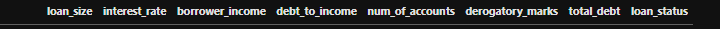
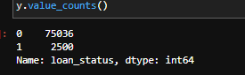

# Credit Risk Predictor
Challenge 12 for Fintech bootcamp through UC Berkeley. Using logistic regression models to help predict credit loan risk. Utilizing sklearn packages and oversampling techniques to create two logistic regression models to predict credit loan risk and compare the results.

The notebook in this repo `credit_risk_resampling.ipynb` reads in a CSV file containing loan data with several features that ultimately result in a loan being low-risk '0' or high-risk '1'. The features that determine the risk level can be seen below;

In the above image we can see there are 7 features (from loan_size to total_debt) that help decide whether the loan_status is a 0 or a 1 (low-risk or high-risk). The purpose of creating logistic regression models for this data is to see if we can get the model to accurately predict whether new loans, containing only the feature data, will be low or high risk(0 or 1). Given that I am trying to create a model that will predict high-risk loans or a '1', I wanted to see how many 1s there was in my testing data compared to 0s. 
By using `value_counts()`

I noticed that roughly 3% of the data is high-risk, meaning any model trained on the original data would be really good at detecting low-risk loans or 0s. However, it would struggle to accurately detect any high-risk loans due to the small amount of them in the test data. To account for this I created two models. One on the original data, and one on oversampled data using the RandomOversampler from the imblearn package. Then after having two models I could compare the two and see how the each did. For both models I used the `LogistricRegression` method with `random_state=1` to make sure they started identically. 

---
## Packages and Version

---
## Usage and Results

---
## Contributors

[Robin Thorsen] (https://www.linkedin.com/in/robin-thorsen-079819120/) was the main developer/analyst working on this project. Starter code and resources provided by UC Berkeley.

Best reached via email - robinbthorsen@gmail.com

---

## License

Apache 2.0 public License applied, feel free to clone and fork and use and reach out if you have questions. 

